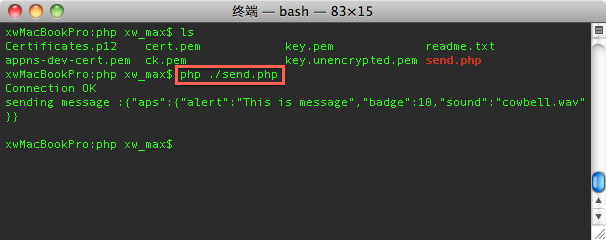
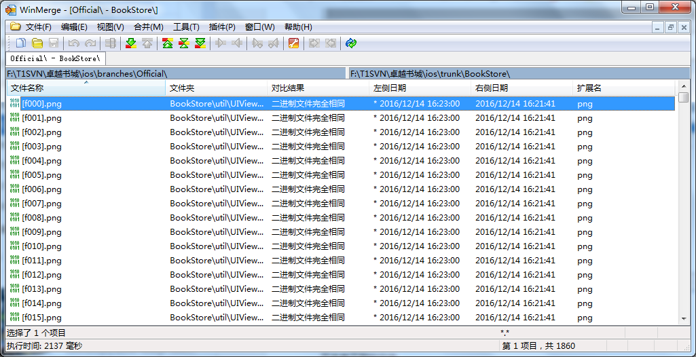

#隔壁大书ios文档
[TOC]
##关于打包流程
###关于平台的打包流程</br>
###关于单本转平台打包发布流程</br>
#####1:修改bundle id 修改版本号 version 修改产品名称bundle name
```
./targets/General/bundle id 
./targets/General/version
./targets/info/bundle name
```
#####2:修改资源文件
```
每本的资源文件在single_pack下对应名称目录
icon<br>
home_page@2x.jpg 390 × 524<br>
load_page@2x.jpg 640 × 1136<br>
s2p_p0_bg.jpg<br>
s2p_p1_bg.jpg<br><br>
s2p_sbg.jpg<br>
s2p_start_hover@2x.png<br>
s2p_start_hover@3x.png<br>
s2p_start_nor@2x.png<br>
s2p_start_nor@3x.png<br>
share_icon.png<br>
single
singlebook_书籍ID
s2pstyle 样式文件夹全部删除后拷贝
```
#####3:修改配置文件
```
./ServerConfig.h 修改成官网地址
./SinleConfig.h 选择需要的相关属性
./AppSwitch.h isS2PConfig 单本转平台开关
```
#####4:修改微信ID
```
targets/info/url types
```
#####6:选择ipa配置文件
```
tab/rmbcharge_s2p.txt
```
例

```
{"name":"","activityId":0,"cost":[{"id":"com.locojoy.book8swpdS2PIAP1","name":"600馒头币","describe":"隔壁大书,600馒头币","money":600,"RMB":6,"reward":0},{"id":"com.locojoy.book8swpdS2PIAP2","name":"1200馒头币","describe":"隔壁大书,1200馒头币","money":1200,"RMB":12,"reward":0},{"id":"com.locojoy.book8swpdS2PIAP3","name":"3000馒头币","describe":"隔壁大书,3000馒头币","money":3000,"RMB":30,"reward":0},{"id":"com.locojoy.book8swpdS2PIAP4","name":"9800馒头币","describe":"隔壁大书,9800馒头币","money":9800,"RMB":98,"reward":0},{"id":"com.locojoy.book8swpdS2PIAP5","name":"61800馒头币","describe":"隔壁大书,61800馒头币","money":61800,"RMB":618,"reward":0},{"id":"com.locojoy.book8swpdS2PIAP6","name":"5000馒头币","describe":"隔壁大书,5000馒头币","money":5000,"RMB":50,"reward":0}]}
```
#####6:选择对应的证书
```
debug版本
release版本
Product-Archive
```
###关于单本的打包流程</br>

##关于推送

###push服务器部分php.rtfd 文档资料

首先：

为了测试苹果服务器是否通了，执行命令

```
telnet gateway.sandbox.push.apple.com 2195
```
它将尝试发送一个规则的，不加密的连接到APNS服务。如果你看到上面的反馈，那说明你的MAC能够到达APNS。按下Ctrl+C关闭连接。如果得到一个错误信息，那么你需要确保你的防火墙允许2195端口。一般这里都不会出现什么问题。

其次：

php的调用
<font color=Crimson>
注意，要把pem文件和send.php文件放到一个文件夹下，否则会不成功。
会得到错误消息
unable to connect to ssl://gateway.sandbox.push.apple.com:2195 (Unknown error) in /Users/simon/Desktop/0 apple事宜/1 push/send.php on line 5

注意苹果推送服务器地址，如果是development的话用ssl://gateway.sandbox.push.apple.com:2195,如果是Distribution的话用ssl://gateway.push.apple.com:2195
</font>


1. 可以用下面的命令行方式, 


2. 也可以放到apache下面,用browser访问.

apache的网页文档放置路径: /Library/WebServer/Documents

apache配置文件路径: /etc/apache2/httpd.conf


apache的启动
1.打开“终端(terminal)”，输入 sudo apachectl -v，（可能需要输入机器秘密）。如下显示Apache的版本
2.接着输入 sudo apachectl start，这样Apache就启动了。
3.打开Safari浏览器地址栏输入 “http://localhost”，可以看到内容为“It works!”的页面。
其位于“/Library（资源库）/WebServer/Documents/”下，这就是Apache的默认根目录。
4.apache的配置文件在/etc/apache2/httpd.conf下面


###push证书部分的注意点 文档资料

1.服务器端需要两个文件, send.php用来接收token信息和与APNS通讯,
ck.pem是一个证书,用来做服务器和客户端安全验证的. 主要靠cert.pem来保证ssl连接。


2.客户端development和Distribution用的provisioning profile不一样(xcode中选择),
还有服务器上开发和分发用到的ck.pem也是不一样的,要分别制作.


3.制作ck.pem是关键,很多问题都是这个证书制作不对导致.
(1)产生CertificateSigningRequest.certSigningRequest
(2)生成一个不带*的app id, 在portal左边的App IDs里面配置这个app id, 并且下载"aps_developer_identity.cer"证书
注意: 下面用到的certificates.p12文件是在这里下载的而不是在portal的Certificates里面下载的,要仔细看教程
点击某个app id，然后再edit里面配置push notifications，如下图

得到的证书叫aps_developer_identity.cer/aps_production_identity.cer
(仔细对比一下,如果是在portal的certificates里面下载的,是developer_identity.cer)


(3)双击以后导入到keychain里面的是这样的,


注意：push用到的文件是上面的而不是下面那个
注意：push用到的证书和普通开发用的证书是不一样的，制作的时候就不一样，要选择
这个证书全名叫Apple Push Notification service SSL Certificate
前缀是aps，后缀是cer


一个问题：

这个证书没有private key？是因为这个certificate不是由这台电脑的某个登陆用户下的CSR文件生成的！！！！！！


看，上面和下面的simon wang是对应的，这就对了


(4)关键文件就是"aps_developer_identity.cer",
有的文章说只需要这一个文件, 有的需要导入keychain后从里面再导出来的两个文件(cert.p12 and key.p12)
下一步就是制作最终文件了,php需要一个ck.pem文件,.net需要一个做出来的p12文件.

1、把.cer的SSL证书转换为.pem文件，执行命令：

```
openssl x509 -in aps_development.cer -inform der -out PushCert.pem
```
在桌面上会生成一个PushCert.pem文件


2、把私钥Push.p12文件转化为.pem文件：

```
openssl pkcs12 -nocerts -out PushKey.pem -in Push.p12
```
 
这里需要我们输入密码，这个密码也就是我们导出p12文件时的密码。
然后，需要我们对生成的pem文件设置一个密语，这里的密语是要告诉我们服务器的。这样，桌面上又会生成一个PushKey.pem文件
(实际上第一个import password也就是导出密码可以是空，
第二个PEM pass phrase必须填一个，默认填abcd吧, 提示说needs to be at least 4 chars，而且这个密码也可以去掉 -->
用openssl rsa -in PushKey_dis.pem -out PushKey_dis.pem-noenc.pem）

（下面这一步可以不做，看服务器哥们的需求，是要两个pem文件还是一个ck.pem文件）
3、对生成的这两个pem文件再生成一个pem文件，来把证书和私钥整合到一个文件里：

```
cat PushCert.pem PushKey.pem > ck.pem
```
生成ck.pem文件
  


////////dev证书步骤////////

```
openssl x509 -in aps_development.cer -inform der -out PushCert.pem
openssl pkcs12 -nocerts -in Push_dev.p12  -out PushKey.pem
```

 如果你想要移除密码，要么在导出/转换时不要设定或者执行：
 
```
openssl rsa -in PushKey.pem -out PushKey-noenc.pem
cat PushCert.pem PushKey.pem > ck.pem
```


////////dis证书步骤////////

```
production/distribution证书和development证书不一样，制作app store的文件的过程如下：
openssl x509 -in aps_production.cer -inform der -out PushCert_dis.pem
openssl pkcs12 -nocerts -in Push_dis.p12 -out PushKey_dis.pem
openssl rsa -in PushKey_dis.pem -out PushKey_dis-noenc.pem
cat PushCert_dis.pem PushKey_dis.pem > ck_dis.pem
```

////////inhouse证书步骤////////

```
openssl x509 -in aps_production.cer -inform der -out PushCert_dis.pem
openssl pkcs12 -nocerts -in Certificates_inhouse_dis.p12 -out PushKey_dis.pem
openssl rsa -in PushKey_dis.pem -out PushKey_dis-noenc.pem
cat PushCert_dis.pem PushKey_dis.pem > ck_dis.pem
```

这样，我们的文件就制作完了。下面进入测试阶段
为了测试证书是否工作，执行下面的命令：
    
```
telnet gateway.sandbox.push.apple.com 2195
```


服务器部分
send.php文件:如果是development的话用ssl://gateway.sandbox.push.apple.com:2195,如果是Distribution的话用ssl://gateway.push.apple.com:2195

CertificateSigningRequest.certSigningRequest 是请求文件
ios_development.cer是上面的文件放到开发者中心后生成的授权证书 (certificate)

Generate your certificate.

With the creation of your CSR, Keychain Access simultaneously generated a public and private key pair. Your private key is stored on your Mac in the login Keychain by default and can be viewed in the Keychain Access application under the "Keys" category. Your requested certificate will be the public half of your key pair.


Certificates.p12是personal information exchange 文件, 是在keychain里面导出来的，导那个证书样式的文件和里面的钥匙样式的文件都一样，应该是私钥文件.


从制作命令来看，push和.cer和.p12文件有关系，和provisioning profile无关
cer和p12究竟是神马关系
还有，token和什么有关，和下面三个元素：appid，device，证书


各种数字证书的区别
cer后缀的证书文件有两张编码：der

.cer/.crt证书文件是二进制形式存放的，不含密钥。


过程是这样的：

1.（本地）先在本地生成一个签名(CertificateSigningRequest.certSigningRequest)， 上传 
2.（苹果后台）然后下载生成的push notification（推送通知）许可证， 是cer后缀的
3.（本地导入）双击cer文件导入到keychain里面
4.（本地导出）点击此certificate的右键，导出一个p12文件，命名apns-dev-cert.p12
                        点击展开的private key，同样导出一个p12文件，命名apns-dev-key.p12
5.（做服务器需要的文件）
                        通过终端命令将p12文件转化为pem文件
                        在key文件从p12->pen的转化过程中需要设置一个密码，如果服务器不需要可以去掉
                        还可以将两个文件合成一个文件ck.pem
      发给服务器的哥们，供使用！！！ 服务器的哥们有的需要两个文件cert.pem, key.pem, 有的需要一个文件ck.pem

服务器有了这两个许可证就可以把消息发给APNS了（这两个许可证归根到底是从苹果后台来的）

p12文件和pem文件的区别


还有：推送的开发证书有效期是4个月，发布证书是1年

###推送感悟
阅读push服务器部分php和push证书部分的注意点之后也会遇到问题
1. .cer证书为导出的证书,如果是使用其他合作的证书,请先将推送证书安装在本机然后导出文件而不是直接使用文件
2. 生成证书后 测试项目有两个 Apns测试程序跟send.php  send.php使用正确的推送文件也是通不过的 Apns测试程序可以通过,此时证书是正确的,可以正常使用

##关于内购
debug环境中使用测试账号却未进入沙盒测试的解决

```
删除TARGETS-Build Settings-Code Signing Entitlements
```
内购IAP规则
隔壁大书平台

```
com.locojoy.wanshuIAP1 6 600馒头币 隔壁大书,600馒头币 
com.locojoy.wanshuIAP2 12 1200馒头币 隔壁大书,1200馒头币 
com.locojoy.wanshuIAP3 30 3000馒头币 隔壁大书,3000馒头币 
com.locojoy.wanshuIAP4 98 9800馒头币 隔壁大书,9800馒头币 
com.locojoy.wanshuIAP5 618 61800馒头币 隔壁大书,61800馒头币 
com.locojoy.wanshuIAP6 50 5000馒头币 隔壁大书,5000馒头币 
```
单本转平台规则

```
Bundle ID+S2PIAP1 6 600馒头币 隔壁大书,600馒头币 
Bundle ID+S2PIAP2 12 1200馒头币 隔壁大书,1200馒头币 
Bundle ID+S2PIAP3 30 3000馒头币 隔壁大书,3000馒头币 
Bundle ID+S2PIAP4 98 9800馒头币 隔壁大书,9800馒头币 
Bundle ID+S2PIAP5 618 61800馒头币 隔壁大书,61800馒头币 
Bundle ID+S2PIAP6 50 5000馒头币 隔壁大书,5000馒头币 
```
##关于Identifiers 对应APP Name
APP Name |  Bundle ID
--------- | -------------
隔壁大书 | com.locojoy.wanshu
梦境奇缘 | com.locojoy.book1mjqy
请勿乱动 | com.locojoy.book1mjqy
梦境奇缘 | com.locojoy.book1mjqy
请勿乱动 | com.locojoy.book2qwld
氏族崛起 | com.locojoy.book3szjq
魔鬼的宠物 | com.locojoy.book4mgdcw
守墓人 | com.locojoy.book5smr
禁地逃生 | com.locojoy.book6jdts
无字碑宫杀 | com.locojoy.book7wzbgs
死亡派对 | com.locojoy.book8swpd
末世求生手册| com.locojoy.book9msqssc
玄武纪| com.locojoy.book10xwj
尸体租赁合同 | com.locojoy.book11stzlht
校园迷雾 | com.locojoy.book12xymw
##关于版本管理
###关于SVN目录
```
ios下目录分别为branches,tags,trunk.
branches为阶段性release版本
tags为阶段性发布版本
trunk为日常开发版本
```
###如何打tags
建议使用windos系统
branches 合并
比对工具:
windos WinMerge
1:将branches和trunk中的工程文件目录拖动到WinMerge  branches在左侧 trunk在右侧

2:在筛选出的文件夹中选择自己要对比的文件目录

3:合并文件
Text files are different 文本文件是不同的
Text files are identical 文本文件是相同的
双击有不同的文件

Ctrl+F4 关闭当前比对文件
Alt+↑ Alt+↓ 切换到上一个或者下一个不同
Alt+←Alt+→复制到左侧 复制到右侧

合并完成后修改的文件会出现一个.bak的副本文件，这个文件在上传SVN之前是需要删除的

遇到新建的文件，Alt+← 复制文件


图片的更新也是Alt+← 复制文件


删除.bak文件

4:提交比对后修改的文件

tags的创建
1: 选择刚刚合并好的branches 文件，Repo-browser 浏览SVN


2:copy to 分支

路径为tags,工程名为最新的tags名称(项目名+版本号_时间年月日20100101)


3:创建changelog.txt 可以用上次文件的备份修改

F5刷新时间
修改描述文件中的版本信息
查看SVN最后一次的版本

4:选择最新的tags版本与上一次的tags进行比较
右键最新一次的tags，选择mark for comparison

右键上一版本的tags,选择Compare URLs(content only)

比较结果

复制比较结果
更新changelog.txt的svn比较内容
5:更新最新的tags到本地

6:将修改为最新内容的changelog.txt文件添加到刚刚更新的tags中上传

7:最后一步发送邮件，将changelog中的内容以邮件的方式发送


